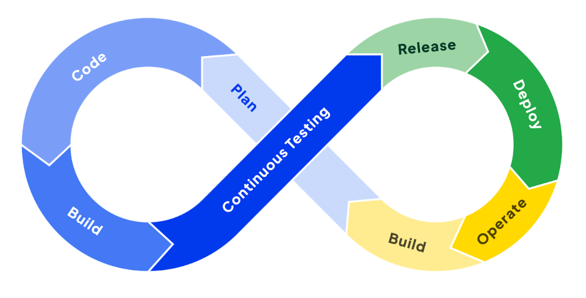
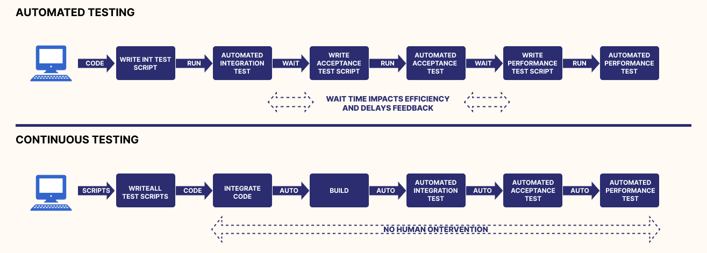

= Continuous Testing
:author: Balint Balazs
:revnumber: 1.1
:revdate: 2024-01-11
:doctype: book
:reproducible:
:icons: font
:sectnums:
:toc:
:source-highlighter: rouge
:docinfo: shared

== Was ist Continuous Testing?

[quote, IBM, "Was sind kontinuierliche Tests?"]
____
Unter Continuous Testing versteht man einen Prozess, bei dem automatisiertes Feedback in verschiedenen Phasen des Softwareentwicklungslebenszyklus (Software Development Life Cycle, SDLC) integriert wird, um die Geschwindigkeit und Effizienz bei der Verwaltung von Bereitstellungen zu verbessern.
____

== Hauptkomponenten von Continuous Testing

*   **Automatisierung:** Der Einsatz von Tools zur Automatisierung von Tests ist entscheidend, um schnelle und wiederholbare Testergebnisse zu erzielen. Dies reduziert die manuelle Arbeit und beschleunigt den Testprozess erheblich.
*   **Integration in CI/CD-Pipelines:** Tests werden nahtlos in Continuous Integration (CI) und Continuous Delivery (CD) Pipelines eingebunden, um bei jedem Code-Commit eine sofortige Qualitätsbewertung zu ermöglichen. So wird sichergestellt, dass Fehler frühzeitig erkannt und behoben werden können.
*   **Stabile Testumgebungen:** Die Bereitstellung konsistenter und produktionsähnlicher Testumgebungen stellt sicher, dass Testergebnisse zuverlässig und aussagekräftig sind. Inkonsistenzen zwischen Test- und Produktionsumgebungen können zu unerwarteten Problemen führen.

== Continuous Testing vs Automated Testing

== Arten von Tests im Continuous Testing

*   **Unit-Tests:** Überprüfung einzelner Codeeinheiten (z.B. Methoden, Klassen) auf korrekte Funktionalität, um sicherzustellen, dass jede Einheit isoliert betrachtet funktioniert.
*   **Integrationstests:** Testen des Zusammenspiels verschiedener Module oder Services, um zu gewährleisten, dass sie korrekt miteinander kommunizieren und Daten austauschen.
*   **End-to-End-Tests (E2E-Tests):** Validierung kompletter Geschäftsprozesse vom Anfang bis zum Ende (z.B. Benutzeranmeldung, Produktsuche, Kaufabschluss), um das Systemverhalten aus Anwendersicht zu prüfen.
*   **Leistungstests (Performance Tests):** Bewertung der Performance (z.B. Reaktionszeit, Durchsatz) der Anwendung unter verschiedenen Lastbedingungen, um sicherzustellen, dass sie auch bei hoher Auslastung stabil bleibt.
*   **Sicherheitstests:** Identifizierung und Behebung von Sicherheitslücken innerhalb der Anwendung, um sie vor Angriffen und unbefugtem Zugriff zu schützen.
*   **UI-Tests (User Interface Tests):** Automatisierte Tests der Benutzeroberfläche, um die korrekte Darstellung und Funktionalität der Anwendung aus Sicht des Endbenutzers zu verifizieren.

== Herausforderungen beim Continuous Testing

*   **Testdatenmanagement:** Die Bereitstellung und Pflege geeigneter, konsistenter und datenschutzkonformer Testdaten kann komplex und zeitaufwändig sein.
*   **Infrastrukturkosten:** Der Aufbau und die Wartung der notwendigen Testinfrastruktur (z.B. Server, Datenbanken, virtuelle Maschinen) erfordern Investitionen und Ressourcen.
*   **Testwartung:** Automatisierte Tests müssen regelmäßig aktualisiert werden, um mit Änderungen im Code, der Architektur und den Anforderungen Schritt zu halten. Veraltete Tests können zu falschen Ergebnissen führen.
*   **Komplexität der Testumgebung**: Das Aufsetzen einer stabilen Testumgebung, die der Produktivumgebung gleicht, ist eine Herausforderung
*   **Zeitaufwand**: Das Ausführen aller Tests kann bei größeren Projekten viel Zeit in Anspruch nehmen

== Überblick: Testframeworks und ihre Einsatzbereiche

[cols="1,1,1,2,1"]
|===
| Tool | Open Source | Lizenz | Einsatzbereiche | Sprachen

| Jenkins
| Ja
| MIT
| CI/CD, Build-Automatisierung
| Groovy, Java

| Selenium
| Ja
| Apache 2.0
| UI-Tests, Web-Automatisierung
| Java, Python, C#, JavaScript, Ruby

| JUnit
| Ja
| Eclipse Public v2.0
| Unit-Tests
| Java

| TestNG
| Ja
| Apache 2.0
| Unit-, Integrationstests, End-to-End-Tests
| Java

| Cypress
| Ja
| MIT
| End-to-End-Webtests
| JavaScript

| JMeter
| Ja
| Apache 2.0
| Last-, Performance-, Stresstests
| Java

| SonarQube
| Teilweise
| LGPLv3/Proprietär
| Code-Analyse, Sicherheitsprüfung
| 25+ Sprachen (Java, C#, Python, etc.)

| Rest-Assured
| Ja
| Apache 2.0
| API-Tests (REST-Services)
| Java

| Mockito
| Ja
| MIT
| Mocking für Unit- und Integrationstests
| Java
|===

== Kriterienkatalog: Vergleich von CI/CD-Tools

[cols="1,1,1,1"]
|===
| Tool | Preisgestaltung | Programmiersprachen | Containerisierung

| Azure Pipelines
| Kostenlos / Kostenpflichtig
| .NET, Java, Python, Node.js
| Ja

| CircleCI
| Kostenlos / Kostenpflichtig
| Ruby, Python, Java
| Ja

| GitHub Actions
| Kostenlos / Kostenpflichtig
| Alle Docker-kompatiblen Sprachen
| Ja

| Jenkins
| Kostenlos, Open Source
| Alle Sprachen
| Ja
|===

== Continuous Testing in Quarkus

Quarkus unterstützt Continuous Testing, eine Funktion, die es ermöglicht, Tests unmittelbar nach dem Speichern von Codeänderungen auszuführen. Dies beschleunigt den Entwicklungsprozess erheblich, da Entwickler sofortiges Feedback zu ihren Änderungen erhalten.

== Funktionsweise von Continuous Testing in Quarkus

* **Automatische Testausführung:**
Quarkus führt Tests automatisch aus, wenn Änderungen erkannt werden.

* **Entwicklungsmodus:**
Im Entwicklungsmodus (`quarkus dev`) sind Tests standardmäßig *pausiert*. Mit der Taste `r` können Tests manuell gestartet werden, wobei die Ergebnisse sofort angezeigt werden.

* **Konfigurationsoptionen:**
Das Verhalten von Continuous Testing kann in der `application.properties`-Datei angepasst werden:
- `quarkus.test.continuous-testing=enabled`: Aktiviert automatisches Testen bei jeder Änderung.
- `quarkus.test.continuous-testing=paused`: Deaktiviert automatisches Testen; Tests müssen manuell gestartet werden.

* **Interaktive Steuerung im Entwicklungsmodus:**
Verschiedene Befehle stehen zur Verfügung, um das Testen effizient zu steuern:
- `r`: Alle Tests erneut ausführen.
- `f`: Nur fehlgeschlagene Tests erneut ausführen.
- `b`: Zwischen allen Tests und fehlgeschlagenen Tests umschalten.
- `v`: Fehlerdetails anzeigen.
- `p`: Tests pausieren.
- `i`: Zusätzliche Testinformationen anzeigen.
- `h`: Hilfe anzeigen.
- `q`: Entwicklungsmodus beenden.

Mit diesen Funktionen unterstützt Quarkus eine schnelle Rückmeldung während der Entwicklung und erleichtert das kontinuierliche Testen.

=== Guide und weiterführende Informationen

*   https://quarkus.io/guides/continuous-testing[Quarkus Continuous Testing Guide]
*   https://quarkus.io/guides/getting-started-testing[Quarkus Testing Guide]
*   https://www.ibm.com/topics/continuous-testing[Was sind kontinuierliche Tests]

== Demo

Im Repository link:https://github.com/2425-5bhif-wmc/01-referate-balintb4[01-referate-balintb4] finden Sie neben dieser Dokumentation zwei Demo-Projekte.

Beide Projekte nutzen GitHub Actions, um Tests automatisiert auszuführen. Es handelt sich um zwei identische Projekte, wobei eines *DevServices* und das andere eine *manuell konfigurierte PostgreSQL-Datenbank* verwendet.

*   **`continuous-testing-demo`**: Beinhaltet eine klassische PostgreSQL-Konfiguration.
*   **`devservices-demo`**: Nutzt Quarkus Dev Services zu Testzwecken.

=== Hauptunterschiede in der GitHub Actions Konfiguration

Der Hauptunterschied zwischen den beiden Projekten liegt in der Art und Weise, wie die PostgreSQL-Datenbank für die Tests bereitgestellt wird. Das Projekt `continuous-testing-demo` erfordert manuelle Schritte, die im Folgenden in der Workflow-Datei dargestellt sind:

[source,yaml]
----
name: Run all test  in continuous-testing-demo project

on:
  push:
    paths:
      - 'continuous-testing-demo/**'
    branches:
      - main
  pull_request:
    branches:
      - main
  workflow_dispatch:

jobs:
  build-backend:
    runs-on: ubuntu-22.04
    steps:
      - uses: actions/checkout@v4
      - uses: KengoTODA/actions-setup-docker-compose@v1 <1>
        with:
          version: '2.14.2'
      - name: Setup Java
        uses: actions/setup-java@v4
        with:
          distribution: 'temurin'
          java-version: '21'
          cache: 'maven'
          cache-dependency-path: 'continuous-testing-demo/pom.xml'

      - name: Start PostgreSQL Database <2>
        run: docker compose -f docker-compose-db.yml up -d

      - name: Wait for database to be ready <3>
        run: |
          until docker compose -f docker-compose-db.yml exec db pg_isready; do
            echo "Waiting for database to be ready..."
            sleep 1
          done

      - name: Set execute permission for the test script
        run: chmod +x .github/cicd/continous-testing-demo-scripts/run-test.sh

      - name: Execute test script <4>
        env: # Setze Umgebungsvariablen für die Verbindung zur DB
          SPRING_DATASOURCE_URL: jdbc:postgresql://localhost:5432/db
          SPRING_DATASOURCE_USERNAME: app
          SPRING_DATASOURCE_PASSWORD: app
        run: .github/cicd/continous-testing-demo-scripts/run-test.sh
----

<1> Auf dem GitHub Actions Runner muss das `docker-compose`-Plugin manuell installiert werden.
<2> Das PostgreSQL-Image muss manuell mit `docker compose` gestartet werden.
<3> Es muss gewartet werden, bis die Datenbank vollständig initialisiert und einsatzbereit ist.
<4> Die Umgebungsvariablen für die Datenbankverbindung müssen explizit gesetzt werden.

[IMPORTANT]
.Wichtige Information zur `docker-compose-db.yml`
====
Die `docker-compose-db.yml`-Datei muss selbst bereitgestellt werden.
====

Im Folgenden sehen Sie  den Inhalt der `docker-compose-db.yml`-Datei, die in diesem Projekt verwendet wird:

.docker-compose-db.yml
[source,yaml,collapsible]
----
version: '3.8'
services:
  db:
    image: postgres:17.0-alpine
    restart: unless-stopped
    environment:
      POSTGRES_USER: app
      POSTGRES_PASSWORD: app
      POSTGRES_DB: db
    ports:
      - 5432:5432
    networks:
      - postgres

networks:
  postgres:
    driver: bridge
----

Im Gegensatz dazu verwendet das Projekt `devservices-demo` die Quarkus Dev Services. Dies vereinfacht die Konfiguration erheblich, da Quarkus die Datenbank automatisch startet und verwaltet. Sie müssen sich nicht um die manuelle Installation von `docker-compose`, das Starten der Datenbank oder das Setzen der Umgebungsvariablen kümmern.

== Fazit
Continuous Testing ist ein mächtiger Ansatz, um die Qualität von Software zu verbessern und die Entwicklungszeit zu verkürzen. Durch die Automatisierung von Tests und die Integration in CI/CD-Pipelines wird sichergestellt, dass Fehler frühzeitig erkannt und behoben werden können. Quarkus bietet mit seinem Continuous-Testing-Feature eine hervorragende Unterstützung für diesen Ansatz.

== Anhang

=== Glossar

*   **CI/CD:** Continuous Integration/Continuous Delivery bzw. Continuous Deployment.
*   **SDLC:** Software Development Life Cycle (Softwareentwicklungslebenszyklus).
*   **Unit-Test:** Test einer einzelnen Codeeinheit (z.B. Methode, Klasse).
*   **Integrationstest:** Test des Zusammenspiels mehrerer Komponenten.
*   **End-to-End-Test (E2E-Test):** Test eines kompletten Anwendungsfalls aus Sicht des Endbenutzers.
*   **Performance Test:** Test zur Überprüfung der Leistungsfähigkeit einer Anwendung.
*   **Sicherheitstest:** Test zur Identifizierung von Sicherheitslücken.

=== Häufig gestellte Fragen (FAQ)

*   **Frage:** Was ist der Unterschied zwischen Continuous Testing und traditionellem Testen?
*   **Antwort:** Beim traditionellen Testen werden Tests oft in einer separaten Phase nach der Entwicklung durchgeführt. Continuous Testing integriert Tests in jede Phase des Entwicklungszyklus und ermöglicht so ein früheres und häufigeres Feedback.

*   **Frage:** Welche Vorteile bietet Continuous Testing?
*   **Antwort:**  Schnellere Feedback-Zyklen, frühere Fehlererkennung, verbesserte Codequalität, erhöhte Effizienz, beschleunigte Bereitstellung.

*   **Frage:** Ist Continuous Testing für jedes Projekt geeignet?
*   **Antwort:** Continuous Testing ist besonders für Projekte mit häufigen Codeänderungen und einem hohen Automatisierungsgrad geeignet. Bei kleineren, weniger komplexen Projekten kann der Aufwand für die Implementierung den Nutzen übersteigen.