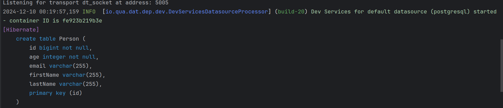
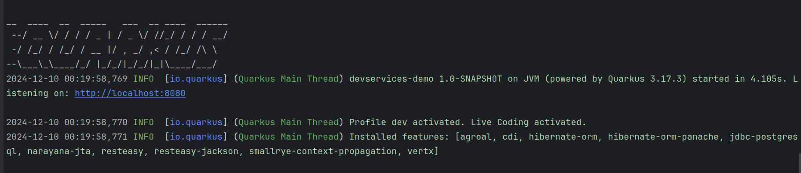

= Quarkus-Anwendung mit PostgreSQL und Dev Services
Erstellt von: Balint Balazs
Version: 1.0
Datum: 2024-12-09

:icons: font
:sectnums:    // Nummerierung der Überschriften / section numbering
:toc: left
:source-highlighter: rouge
:docinfo: shared

== Voraussetzungen

Bevor du beginnst, stelle sicher, dass du die folgenden Tools installiert hast:

- **Java 17** oder höher
- **Maven**
- **Docker** (für die Ausführung von Dev Services)
- **PostgreSQL** (für den direkten Zugriff, wenn nötig)

==  Projekt erstellen
Erstelle ein neues Quarkus-Projekt

==  Abhängigkeiten

Stelle sicher, dass die folgenden Abhängigkeiten
in deiner pom.xml (für Maven) enthalten sind:
[source,xml]
----
<dependencies>
<!-- Quarkus RESTEasy für REST APIs -->
<dependency>
<groupId>io.quarkus</groupId>
<artifactId>quarkus-resteasy</artifactId>
</dependency>

    <!-- Quarkus Hibernate ORM für die Datenbankintegration -->
    <dependency>
        <groupId>io.quarkus</groupId>
        <artifactId>quarkus-hibernate-orm-panache</artifactId>
    </dependency>

    <!-- PostgreSQL JDBC-Treiber -->
    <dependency>
        <groupId>org.postgresql</groupId>
        <artifactId>postgresql</artifactId>
    </dependency>
</dependencies>
----
== Konfiguration der PostgreSQL-Datenbank

Quarkus Dev Services
wird automatisch eine PostgreSQL-Datenbank für dich starten.
Du musst jedoch die Verbindungsdetails in der Konfiguration festlegen.
Öffne die Datei `src/main/resources/application.properties`
und füge die folgenden Konfigurationen hinzu:

=== Quarkus Datenbank Konfiguration

[source,properties]
----
quarkus.datasource.db-kind=postgresql <1>
quarkus.datasource.username=your_username <2>
quarkus.datasource.password=your_password <3>

quarkus.hibernate-orm.database.generation=update <4>
quarkus.hibernate-orm.log.sql=true <5>
quarkus.hibernate-orm.log.format-sql=true <6>

quarkus.datasource.devservices.enabled=true <7>
quarkus.datasource.devservices.image-name=postgres:latest <8>

----
=== Erklärung
<1> Gibt an, dass PostgreSQL als Datenbank verwendet wird.
<2> Der Benutzername für den PostgreSQL-Datenbankzugriff.
<3>  Das Passwort für den PostgreSQL-Datenbankzugriff.
<4>  Sagt Hibernate, dass es die Datenbankstruktur beim Start aktualisieren soll.
<5>   Aktiviert das SQL-Logging, damit SQL-Abfragen im Log sichtbar sind.
<6>  Formatiert SQL-Abfragen für bessere Lesbarkeit im Log.
<7>   Aktiviert Dev Services, die eine Datenbank im Docker-Container starten.
<8>  Gibt das Docker-Image für PostgreSQL an, das verwendet werden soll.

== Erstellen der `Person`-Entität

Nun erstellst du eine Entität, die du in der Datenbank speichern möchtest.
Erstelle die Datei `src/main/java/com/example/model/Person.java`:

```java
package com.example.model;

import io.quarkus.hibernate.orm.panache.PanacheEntity;

import javax.persistence.Entity;
import javax.persistence.Table;

@Entity
@Table(name = "person")
public class Person extends PanacheEntity {
    public String firstName;
    public String lastName;
    public String email;

    public Person() {
    }

    public Person(String firstName, String lastName, String email) {
        this.firstName = firstName;
        this.lastName = lastName;
        this.email = email;
    }
}
```
Die Klasse Person erweitert PanacheEntity, wodurch Quarkus automatisch CRUD-Operationen für diese Entität bereitstellt.

==  Erstellen eines REST Endpunkts

Erstelle nun einen REST-Endpunkt, um die Entitäten über eine API verfügbar zu machen. Erstelle die Datei src/main/java/com/example/resource/PersonResource.java:

[source,java]
----
package com.example.resource;

import com.example.model.Person;
import javax.ws.rs.GET;
import javax.ws.rs.Path;
import javax.ws.rs.Produces;
import javax.ws.rs.core.MediaType;
import javax.ws.rs.core.Response;
import javax.inject.Inject;

@Path("/persons")
public class PersonResource {

    @Inject
    PersonRepository personRepository;

    @GET
    @Path("/all")
    @Produces(MediaType.APPLICATION_JSON)
    public Response getAllPersons() {
        if (personRepository.count() == 0) {
            return Response.status(Response.Status.NOT_FOUND).build();
        }
        return Response.ok(personRepository.findAll()).build();
    }
}
----
=== Erklärung:

Dieser Endpunkt liefert alle Person-Entitäten als JSON zurück.
== 6. Optional: Datenbank mit DatabaseSeed initialisieren

Um einige Daten beim Start der Anwendung zu erstellen, kannst du eine DatabaseSeed-Klasse hinzufügen, die beim Start der Anwendung Daten in die Datenbank einfügt.

Erstelle die Datei src/main/java/com/example/DatabaseSeed.java:

[source,java,linenums]
----
package com.example;

import com.example.model.Person;
import io.quarkus.runtime.StartupEvent;
import javax.enterprise.context.ApplicationScoped;
import javax.enterprise.event.Observes;
import javax.inject.Inject;
import javax.transaction.Transactional;

@ApplicationScoped
public class DatabaseSeed {

    @Inject
    PersonRepository personRepository;

    @Transactional
    void onStart(@Observes StartupEvent ev) {
        if (personRepository.count() == 0) {
            personRepository.persist(new Person("John", "Doe", "john.doe@example.com"));
            personRepository.persist(new Person("Jane", "Doe", "jane.doe@example.com"));
        }
    }
}
----
=== Erklärung:

Diese Klasse fügt beim Start der Anwendung einige Person-Entitäten hinzu, wenn noch keine vorhanden sind.

== 7. Anwendung starten
 mvn quarkus:dev

.Result
[%collapsible]
====




====

== Zusammenfassung

In dieser Anleitung haben wir eine Quarkus-Anwendung
mit einer PostgreSQL-Datenbank erstellt,
die von Quarkus Dev Services automatisch verwaltet wird.
Wir haben eine einfache REST-API erstellt,
um mit der Datenbank zu interagieren, und beim Start der Anwendung einige Daten eingefügt. Die Verwendung von Dev Services macht das Setup der Datenbank sehr einfach, ohne dass du manuell Docker-Container oder PostgreSQL installieren musst.
